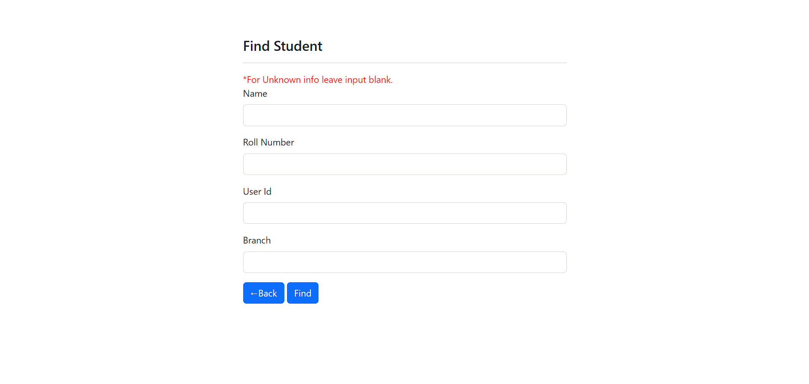
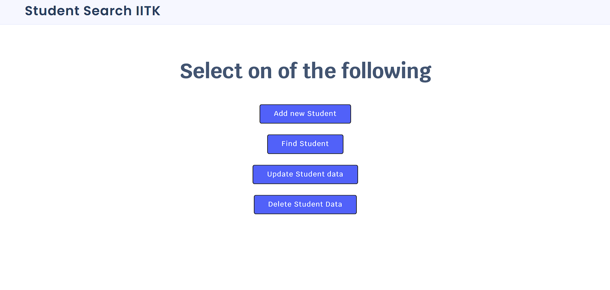
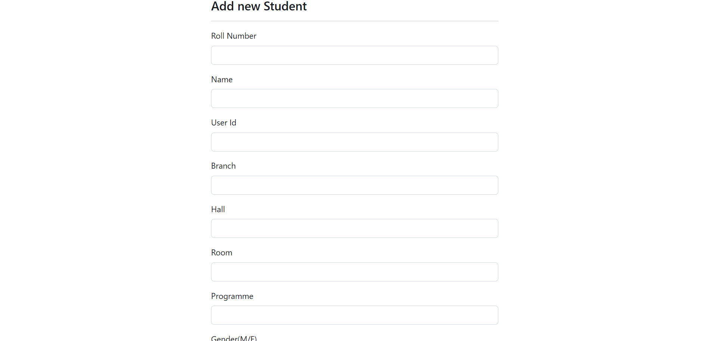
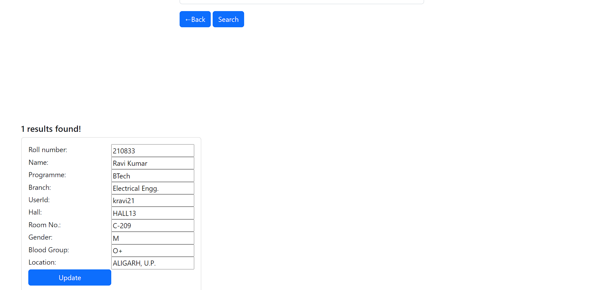
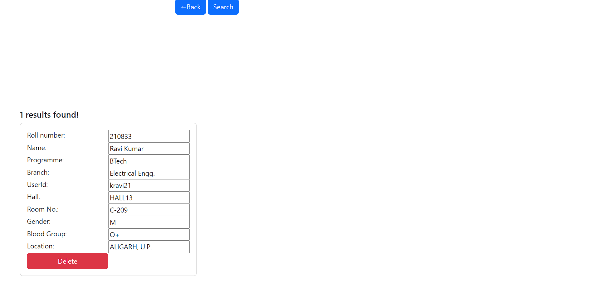

<h1>Student Registry</h1> 

This project is a clone of <b> <a href="https://search.pclub.in/" target="_blank"> Student Search IITK </a></b> which is a website for finding the data of students in IITK. Current version only have the data of Y21 Batch.

The home page of this site looks like -
 

There is a button for Find Students which navigates to the next page which looks like the- 

This page contains a form, which contains 4 input. one can apply any of the filter also none of the filter. No. of filter is totally up to the user. By clicking on "Find" button one can see the filtered results.

One can go back to the main page by clicking 'Back' button.

There is a option for login in the top right corner on home page which navigates to the login page which looks like- 

After successfully login the home page looks like-

There are four options- 
1.Add Student 
2.Find Student. 
3.Update student data. 
4.Deleting student data. 
<h3>1.Adding a new Student</h3> 
"Add new Student" button navigates to the adding page which looks like-  

This page contains a form, after filling the form and hitting "Add " button will add the data to the data base.
 

One can go back to the main page by clicking 'Back' button.

<h3>2.Find Student</h3> 

This is the same page

<h3>3.Update Student Data</h3> 
"Update Student Data" button navigates to the update page 

First one has to search the student for updating the data for that either one filter or both the filter can be applied for searching.
 

The search result looks like this-
 

One can go update the all deltails except the roll no. of the student.

One can back to the main page by clicking 'Back' button.

<h3>4.Delete Student Data</h3> 
    
First one has to search the student for deleting the data for that either on filter or both the filter can be applied for searching.
 
    
The search result looks like this-
 
    
    
After clicking on the "Delete" button the the student data is no longer stored in database

    
One can go back to the main page by clicking 'Back' button.
